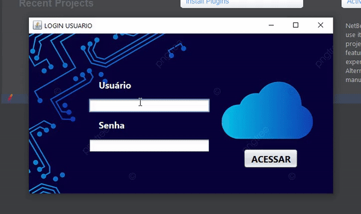

# tela-login-java
Login screen made in vanilla Java, just to pratice.

## Sobre o projeto

 Uma tela de login integrada com MySQL (banco de dados). 

A conexão com o banco de dados é feita pela classe "ConexaoDAO" lozalizada no pacote DAO, por enquanto só tem a função 
de logar com dados previamente carregados no MySQL, mas logo estarei aprimorando para cadastrar, listar e etc.

 

